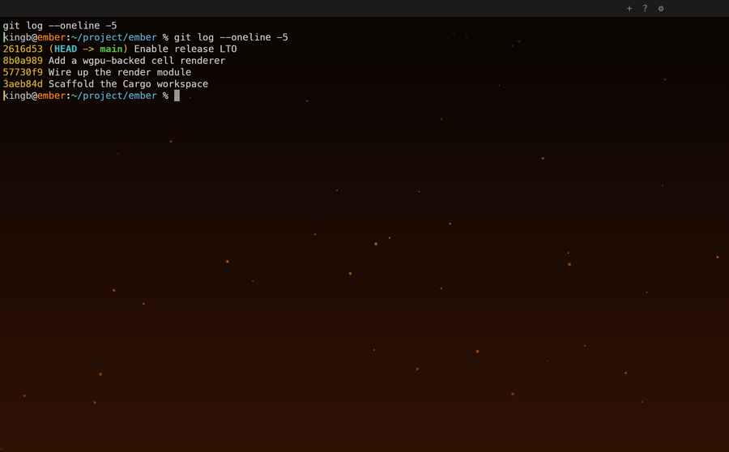

# Ember

[](https://github.com/kingb/ember/actions/workflows/ci.yml)
[](https://github.com/kingb/ember/releases)
[](LICENSE-MIT)
[](https://emberterm.com/download)

Ember started with a simple question, **where's iTerm2 for Linux?**, and grew into
its own thing: a native terminal emulator, built from scratch in Rust for macOS and
Linux. Not a port of the macOS source, not an extension of an existing terminal, but
a daily-driver replacement in its own right.

**[Website](https://emberterm.com)** ·
**[Docs](https://emberterm.com/docs)** ·
**[Download](https://emberterm.com/download)** ·
**[Changelog](CHANGELOG.md)**



## Install

```sh
brew install --cask kingb/ember/ember    # macOS
brew install kingb/ember/ember           # Linux
```

Or grab a signed, notarized build from the
[releases page](https://github.com/kingb/ember/releases), or
[build from source](BUILDING.md).

## Highlights

- **GPU-rendered**, wgpu end to end: text, chrome, and effects in one pipeline.
- **Splits and tabs** with iTerm2-familiar keys, drop-zone splitting, and
  drag-to-reorder tabs.
- **Shell integration** out of the box: exit-status marks in the gutter and
  jump-to-previous-command, no shell config required.
- **A campfire built in**: a warm gradient backdrop out of the box, and
  opt-in drifting ember sparks, live-tunable in Settings.
- **One codebase, two platforms**: the same terminal on macOS and Linux.

## Architecture at a glance

Layered, single-process Rust workspace. The daemon/multi-process split is deferred, but
its boundary is front-loaded. Full picture in the
[design doc](docs/design/2026-06-27-ember-design.md).

| Crate | Responsibility |
|---|---|
| `ember-core` | Pure domain: the neutral grid model (`NeutralCell`/`GridDelta`, engine-agnostic), `SessionBackend` trait, layout tree, focus/layout, profiles, OSC/trigger matching. No IO. |
| `ember-session` | Backend impls: `LocalPty` (v1, wraps `alacritty_terminal`'s parser and grid as the VT engine, then projects it into the neutral grid), `TmuxControlMode` (phase 2), `a future out-of-process backend` (future). |
| `ember-render` | wgpu + glyphon text, plus a hand-rolled quad pass for backgrounds, cursor, box-drawing sprites, and all chrome (tabs, Settings, About, overlays). |
| `ember-platform` | winit + `PlatformBackend`, the clipboard/open-path seam. Real `MacBackend` and `LinuxBackend` impls, both backed by `arboard`. Global hotkey isn't implemented yet. |
| `ember-app` | Binary: event loop, input routing, layout, config; trigger dispatch. |

The render layer only ever sees the neutral grid, never a specific VT engine's
own types. That's what makes `SessionBackend` genuinely swappable: any backend
(local PTY today, tmux control mode or an out-of-process bus later) just has to
translate into `NeutralCell`/`GridDelta`, and every other crate keeps working
unchanged. Two extension seams overall: **`SessionBackend`** (tmux / daemon /
bus) and **`PlatformBackend`** (macOS and Linux).

## Stack

`winit` · `wgpu` · `glyphon`/`cosmic-text` · `alacritty_terminal` (swappable) ·
`portable-pty`.

## Building & releasing

Everyday development is `cargo build` / `cargo run -p ember-app`. Packaging,
signing, notarization, and the Homebrew release flow live in
[BUILDING.md](BUILDING.md).

## Thanks

Ember's terminal parsing and grid engine is built on
[`alacritty_terminal`](https://github.com/alacritty/alacritty), the library
behind [Alacritty](https://alacritty.org), one of the fastest terminal
emulators out there. Ember wouldn't exist without it. If you haven't tried
Alacritty itself, go give it a look. It's excellent. Thank you to its
maintainers and contributors.

Beyond that dependency, Ember owes a debt of inspiration to the terminals that
came before it. [iTerm2](https://iterm2.com) set the bar for the splits and
shell integration Ember treats as a baseline; [Ghostty](https://ghostty.org)
reshaped what a modern GPU terminal should feel like. Building Ember gave me
real appreciation for how much careful work a good terminal takes, and for the
people who did it first. If Ember isn't your fit, one of them likely is.

## License

Dual-licensed under [MIT](LICENSE-MIT) or [Apache-2.0](LICENSE-APACHE), at
your option.
